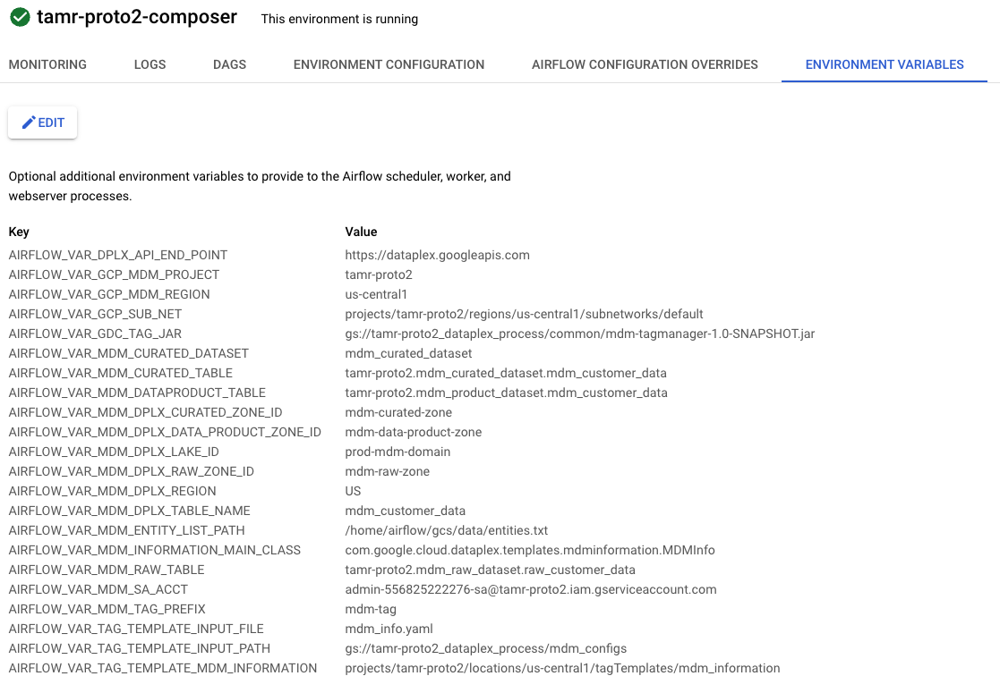
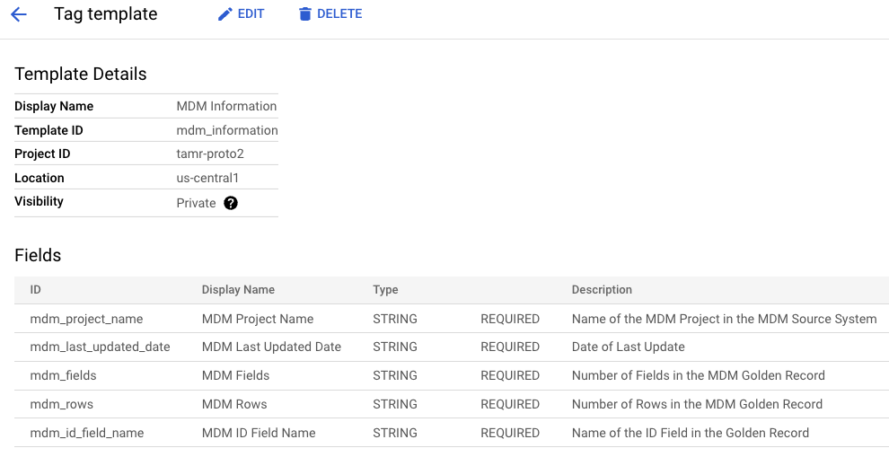
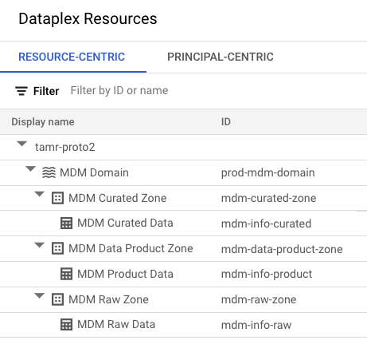
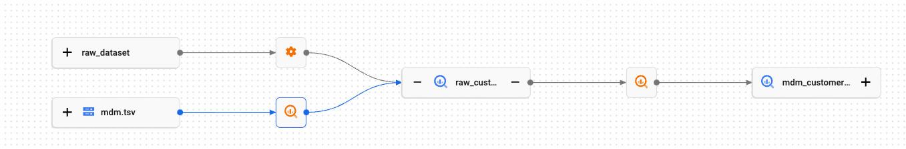

BigLake Finegrained Permissions Lab

## 1. Prerequisites 

### 1.1. Create a project
Note the project ID. <br>
We will need this for the rest of the lab.

### 1.2. Grant yourself Security Administrator role<br>
This is needed for the networking setup.<br>
Go to Cloud IAM and through the UI, grant yourself security admin role.

### 1.3. Grant yourself Organization Policy Administrator at an Organization level<br>
This is needed to set project level policies<br>
In the UI, set context to organization level (instead of project)<br>
Go to Cloud IAM and through the UI, grant yourself Organization Policy Administrator at an Organization level.<br>
Don't forget to set the project back to the project you created in Step 1 above in the UI.

## 2. Details about the environment that is setup by this module

### 2.1. Products/services used in the lab
The following services and resources will be created via Terraform scripts:

1. VPC, Subnetwork and NAT rules
2. IAM groups for USA and Australia
3. IAM permissions for user principals and Google Managed default service accounts
4. GCS buckets, for each user principal and for Dataproc temp bucket
5. Dataplex Policy Tag Template for MDM Information
6. BigQuery Dataset, Table and Row Level Policies
7. Composer Environment with Pre-Defined Environment Variables

### 2.2. Tooling

1. Terraform for automation
2. Cloud Shell for executing Terraform

<hr>

## 3. Provision the GCP environment 

This section covers creating the environment via Terraform from Cloud Shell. 
1. Launch cloud shell
2. Clone this git repo
3. Provision foundational resources such as Google APIs and Organization Policies
4. Provision the GCP data Analytics services and their dependencies for the lab

### 3.1. Create a Cloud Shell Session
Instructions for launching and using cloud shell are available [here](https://cloud.google.com/shell/docs/launching-cloud-shell).

### 3.2. Clone the workshop git repo

```
cd ~
git clone https://github.com/j-f-oleary-bigdata/mdm_proto
```

### 3.3. About the Terraform scripts

#### 3.3.1. Navigate to the Terraform directory
```
cd ~/mdm_proto/
```

#### 3.3.2. Review the Terraform directory structure (& optionally, the content)

Browse and familiarize yourself with the layout and optionally, review the scripts for an understanding of the constructs as well as how dependencies are managed.

#### 3.3.3. What's involved with provisioning with Terraform

1. Define variables for use with Terraform
2. Initialize Terraform
3. Run a Terraform plan & study it
4. Apply the Terraform to create the environment
5. Validate the environment created

### 3.4. Provision the environment

#### 3.4.1. Define variables for use

Modify the below as appropriate for your deployment..e.g. region, zone etc. Be sure to use the right case for GCP region & zone.<br>
Make the corrections as needed below and then cut and paste the text into the Cloud Shell Session. <br>

```
PROJECT_ID=`gcloud config list --format "value(core.project)" 2>/dev/null`
GCP_ACCOUNT_NAME=`gcloud auth list --filter=status:ACTIVE --format="value(account)"`
PROJECT_NBR=`gcloud projects describe $PROJECT_ID | grep projectNumber | cut -d':' -f2 |  tr -d "'" | xargs`

echo "PROJECT_ID=$PROJECT_ID"
```

#### 3.4.2. Provision foundational resources

Foundational resources in this lab constitute Google APIs and Organizational Policies. 

##### 3.4.2.1. Initialize Terraform
The command below needs to run in cloud shell from ~/mdm_proto/org_policy

```
cd ~/mdm_proto/terraform/org_policy
terraform init
```

##### 3.4.2.2. Terraform deploy the resources

The terraform below first enables Google APIs needed for the demo, and then updates organization policies. It needs to run in cloud shell from ~/mdm_proto/org_policy. <br>

**Time taken to complete:** <5 minutes

```
terraform apply \
  -var="project_id=${PROJECT_ID}" \
  --auto-approve
```

#### 3.4.3. Provision data analytics services & dependencies

##### 3.4.3.1. Initialize Terraform

Needs to run in cloud shell from ~/mdm_proto/terraform
```
cd ~/mdm_proto/terraform
terraform init
```

##### 3.4.3.2. Review the Terraform deployment plan

Needs to run in cloud shell from ~/mdm_proto/terraform
```
terraform plan \
  -var="project_id=${PROJECT_ID}" \
  -var="ldap=${GCP_ACCOUNT_NAME}" \
```

##### 3.4.3.3. Terraform provision the data analytics services & dependencies

Needs to run in cloud shell from ~/mdm_proto/demo. 
 <br>

**Time taken to complete:** <10 minutes

```
terraform apply \
  -var="project_id=${PROJECT_ID}" \
  -var="ldap=${GCP_ACCOUNT_NAME}" \
  --auto-approve
```
<br>
##### 3.4.4. Run Composer Dags

Run the following DAG's in order

  * mdm_copy_raw_to_curated.py
   - copies raw BQ table from raw dataset to curated dataset
  * mdm_copy_curated_to_product.py
   - copies curated BQ table from raw dataset to product dataset
  * create_mdm_information_tag.py
   - Adds 'MDM Information' tag to the mdm_customer_data entity in the mdm-data-product-zone
   - Note: You may have to wait until the entity is discovered and added to Dataplex to run this DAG

<hr>


## 4. Validate the Terraform deployment

From your default GCP account (NOT to be confused with the three users we created), go to the Cloud Console, and validate the creation of the following resources-

### 4.1. IAM users
Validate IAM users in the project, by navigating on Cloud Console to -
1. Youself
2. TBD

### 4.2. IAM roles

a) User Principles:<br>
1. TBD: Viewer, Dataproc Editor
<br>

b) Google Managed Compute Engine Default Service Account:<br>
1. <YOUR_PROJECT_NUMBER>-compute@developer.gserviceaccount.com
<br>

c) Google Managed Composer Default Service Account:<br>
1. composer-service-account@dPROJECT_ID>.iam.gserviceaccount.com
<br>

d.) User Managed Service Account for accessing BigQuery and Dataplex:<br>
1. admin-<YOUR-PROJECT_NUMBER>-sa@<PROJECT_ID>.iam.gserviceaccount.com

### 4.3. GCS buckets
1. <project_id>-_dataplex_process
  * Jar Files, Composer Dag Scripts, Configuration Files


### 4.4. Network resources
Validate the creation of-
1. VPC called default
2. Subnet called default
3. Firewall called subnet-firewall
4. Cloud Router called nat-router
5. Cloud NAT gateway called nat-config

### 4.5. Cloud Composer Environment

From your default login, go to the cloud console and then the Composer Environment UI & validate the creation of the following Composer Environment:
1. <project-id>-composer

<br><br>
 

### 4.6. Policy Tag Template
Navigate to Dataplex->Policy Tag Templates and you should see a template called 'MDM Information'
1. This tag is created by a java program called via Terraform and describes the MDM Golden Records as shown below:<br>
<br><br>
 


### 4.7. BigQuery Dataset
In the BigQuery console, you should see the following datasets which are created by the TF scripts:
1. Created Directly by Terraform Scripts:
 * mdm_raw_dataset
 * mdm_curated_dataset
 * mdm_prouct_dataset
2. Created Indirectly when Dataplex Creates Zones:
 * mdm_raw_zone
 * mdm_curated_zone
 * mdm_product_zone

### 4.8. MDM Tables
BigQuery tables created:
1. mdm_raw_dataset.raw_customer_data (created by TF Script)
2. mdm_curated_dataset.mdm_customer_data (created by Composer DAG)
3. mdm_product_dataset.mdm_customer_data (created by Composer DAG)


### 4.9. Dataplex Lake and Zones and Assets
* Lake/Domain: MDM Domain
 * Zones / Assets:
  * MDM Raw Zone:
   * MDM Raw Data
  * MDM Curated Zone:
   * MDM Curated Data
  * MDM Product Zone
   * MDM Product Data

 

### 4.10. Lineage

End to End BigQuery Lineage can be seen on the 'raw_customer_data' BigQuery Table.   The picture below shows how the data initially comes from Tamr, is copied to BigQuery and then copied to the Curated Zone.

 


<hr>
